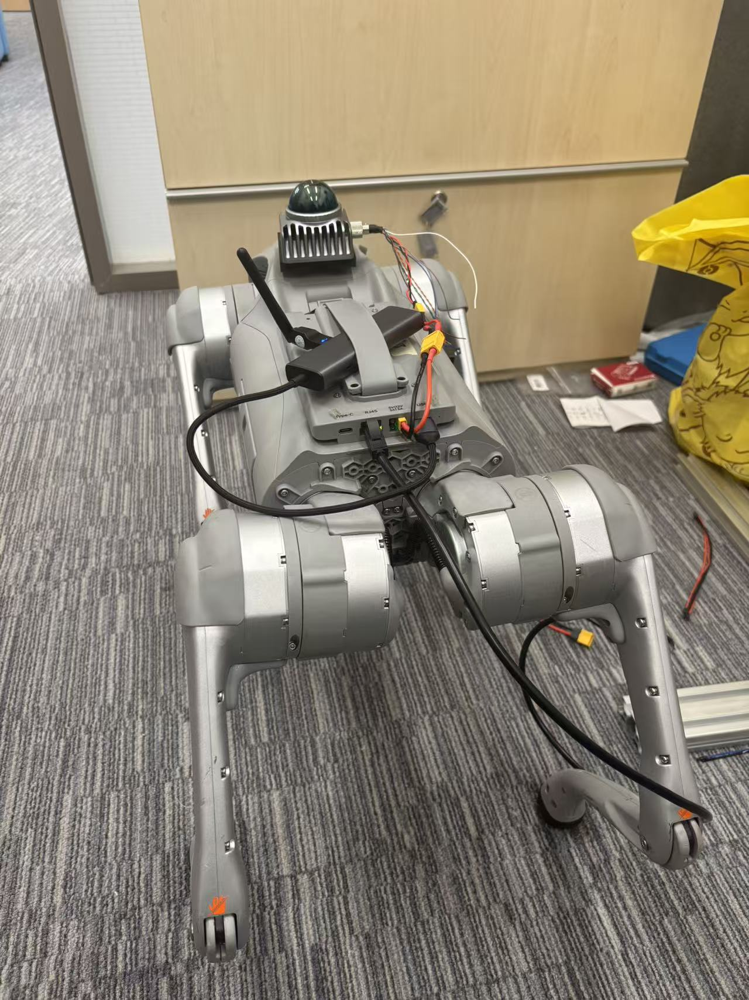
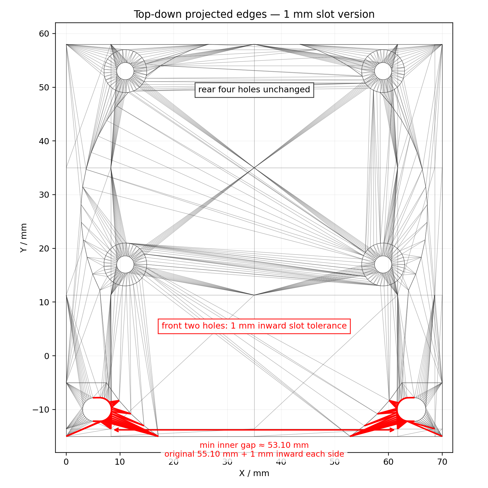

# Unitree Go2 + Jetson Livox MID-360 Top Mount  
# 宇树 Unitree Go2 加装 Jetson 版本 Livox MID-360 顶部支架

[English](#english) | [中文](#中文)

---

## English

### Overview

This repository provides a 3D-printable top mounting bracket for installing a **Livox MID-360 LiDAR** on a **Unitree Go2 with an added Jetson module**.

Unlike many back-deck mounting solutions, this design places the MID-360 **above the Go2 head / front-top area**. The purpose is to keep the LiDAR dome higher and more exposed, so that the sensor has a better surrounding view and is less blocked by the Go2 body, Jetson module, power cables, USB/Ethernet adapters, and other onboard devices.

This mount is designed for robotics experiments such as:

- LiDAR SLAM / LIO
- Go2 navigation and localization
- MID-360 data collection
- Jetson onboard perception experiments
- real-robot deployment where the original rear/top deck is already occupied by Jetson or other electronics

> This is a community/open-source mechanical adapter, not an official Unitree or Livox product. Please verify hole positions, screw length, clearance, and mechanical strength on your own robot before operation.

---

### Images

#### Full installation overview

Place the full robot photo here:

```markdown

```


#### CAD / hole-layout preview

Place the top-down CAD / hole-layout preview here:

```markdown

```


---

### Design motivation

Many MID-360 mounts for Unitree Go2 assume that the top/back platform is mostly clean. In the **Go2 EDU / Jetson-added configuration**, however, the upper body area is often already occupied by:

- a Jetson module
- power cables
- USB/Ethernet adapters
- XT connectors
- network modules or additional electronics

A rear-mounted MID-360 may therefore be partially blocked by the Jetson or cable bundle. This design moves the sensor to the **front-top/head area**, with the goal of preserving a more useful LiDAR field of view for SLAM, localization, and navigation.

---

### Mechanical design

The bracket follows a simple mechanical logic:

1. **Four MID-360 mounting holes**  
   The four main holes on the upper mounting plate correspond to the MID-360 mounting pattern. They are intended for M3 screws used to fasten the MID-360 to the printed bracket.

2. **Two Go2 front mounting holes**  
   The two front holes correspond to the existing threaded holes on the top/front area of the Unitree Go2 body. These holes are used to fix the bracket to the robot.

3. **1 mm inward slot tolerance**  
   The two Go2-side front holes are designed as short inward slots instead of perfect circular holes. Each side has about 1 mm inward tolerance. This compensates for real measurement error, 3D-printing shrinkage, and small manufacturing differences between robots.

4. **Rear four holes unchanged**  
   The four MID-360 mounting holes should remain unchanged unless you intentionally redesign the LiDAR-side mounting pattern.

5. **Top-mounted sensor placement**  
   The MID-360 is placed above the Go2 head/front-top region to improve visibility and reduce occlusion from the Jetson platform and cables.

---

### Important dimensions and hole logic

| Feature | Description |
|---|---|
| LiDAR-side mounting holes | 4 × M3 clearance holes for Livox MID-360 mounting |
| Robot-side mounting holes | 2 × M3 clearance / short-slot holes for Go2 threaded mounting points |
| Front-hole measured reference | 55.10 mm inner-side reference distance measured on the Go2 body |
| Slot tolerance | 1 mm inward slot tolerance on each of the two front holes |
| Slot purpose | Compensates for printing tolerance and real robot measurement error |
| Rear four holes | Kept unchanged for the MID-360 mounting pattern |

> The 55.10 mm value refers to the measured inner-side distance from the real Go2 body, not the screw center-to-center distance. Do not reinterpret it as center pitch.

---

### Repository structure

Suggested structure:

```text
unitree-go2-jetson-mid360-top-mount/
├── README.md
├── LICENSE
├── cad/
│   └── unitree_go2_jetson_mid360_top_mount.stl
└── media/
    ├── go2_mid360_jetson_overview.jpg
    └── topdown_slot_preview.png
```

| File | Description |
|---|---|
| `cad/unitree_go2_jetson_mid360_top_mount.stl` | Printable STL model of the bracket |
| `media/go2_mid360_jetson_overview.jpg` | Full installation overview photo |
| `media/topdown_slot_preview.png` | Top-down preview showing the hole layout and 1 mm slot tolerance |
| `README.md` | Project documentation |
| `LICENSE` | Open-source license file |

---

### Required hardware

| Part | Quantity | Notes |
|---|---:|---|
| Livox MID-360 | 1 | LiDAR sensor |
| Unitree Go2 with Jetson module | 1 | Target robot platform |
| 3D-printed bracket | 1 | Print from the STL file |
| M3 screws for MID-360 | 4 | Length depends on bracket thickness and MID-360 thread depth |
| M3 screws for Go2 body | 2 | Use appropriate length for the Go2 threaded holes |
| M3 flat washers | 6 | Strongly recommended, especially for the two front slots |
| M3 spring washers or blue threadlocker | optional | Helps prevent loosening under vibration |
| Cable ties / cable clips | optional | For cable routing |

Screw notes:

- Do not use screws that are too long. They may bottom out or damage threads/components.
- For 3D-printed parts, flat washers are strongly recommended to distribute clamping force.
- For the two slotted front holes, washers are especially important because the slots rely on clamping force.

---

### 3D printing settings

Suggested settings:

| Setting | Recommended value |
|---|---|
| Material | PETG, PLA+, ABS, ASA, or PA-CF |
| Layer height | 0.20 mm |
| Walls / perimeters | 4 or more |
| Infill | 35–50% |
| Top/bottom layers | 5 or more |
| Supports | Enable if required by the selected print orientation |
| Brim | Recommended if warping occurs |
| Orientation | Keep the main mounting face flat when possible |

Material suggestions:

- **PETG**: recommended general-purpose option; tougher than standard PLA.
- **PLA+**: easy to print and acceptable for indoor testing, but may creep under long-term load or heat.
- **ASA / ABS**: better heat resistance, but needs a more controlled printing environment.
- **PA-CF / nylon-CF**: stronger and stiffer; recommended for more serious field tests if available.

---

### Assembly instructions

1. **Print the bracket**  
   Print the STL with enough walls and infill. Remove support material and clean the holes if necessary.

2. **Check screw fit before installation**  
   Test all holes with M3 screws before mounting the bracket on the robot. The Go2-side front holes are clearance/slot holes, not threaded holes.

3. **Mount the MID-360**  
   Align the MID-360 with the four LiDAR-side mounting holes. Use 4 × M3 screws to fasten the LiDAR to the bracket. Tighten gradually in a diagonal pattern.

4. **Mount the bracket on the Go2**  
   Align the two front slotted holes with the Go2 top/front threaded holes. Use 2 × M3 screws with flat washers. Adjust the position within the 1 mm slot tolerance, then tighten the screws.

5. **Route the cables**  
   Route the MID-360 power/data cable toward the Jetson or onboard computer. Avoid tight bending and avoid pulling on the LiDAR connector.

6. **Check clearance**  
   Make sure the mount does not collide with the Jetson module, Go2 body shell, head/front cover, cables, emergency stop, or other accessories.

7. **Static vibration check**  
   Before walking the robot, gently shake the mount by hand. If there is visible movement, tighten the screws, add washers, or improve the print quality.

8. **Low-speed walking test**  
   Start with standing or low-speed walking tests. Re-check all screws after the first few minutes of motion.

---

### Notes for SLAM / localization

After mechanical installation, the LiDAR frame still needs to be configured correctly in software.

Recommended checks:

- Verify the MID-360 coordinate-frame orientation.
- Measure or estimate the LiDAR-to-base transform.
- Publish the correct TF, for example `base_link -> mid360`.
- Make sure the MID-360 is approximately level when the Go2 is standing in its normal posture.
- Keep cables away from the LiDAR dome.
- Re-check extrinsics if the mount is removed and reinstalled.

For FAST-LIO, LIO-SAM, or other LIO systems, inaccurate extrinsics may cause drift, tilted maps, or unstable odometry even if the physical mount is rigid.

---

### Why the front holes use 1 mm slots

The Go2-side hole position is based on a real caliper measurement. Since 3D printing and robot shell tolerances can introduce small errors, perfectly circular holes may fail even when the CAD model looks correct.

This design uses a **1 mm inward slot tolerance** on each of the two front holes. Compared with a 2 mm slot, a 1 mm slot is more rigid and less likely to slip, while still providing useful assembly tolerance.

Use M3 flat washers to increase contact area and improve clamping stability.

---

### Safety warning

- Do not operate the Go2 at high speed before the mount is fully tested.
- Re-check all screws after walking tests.
- Use cable ties to prevent cables from entering joints or legs.
- Do not overtighten screws into plastic or threaded holes.
- Do not block the MID-360 dome.
- Protect the LiDAR from impact during falls or collisions.

---

### License

Recommended licenses:

- **MIT License**: simple and permissive.
- **CERN-OHL-S v2**: suitable for open-source hardware.
- **CC BY 4.0**: suitable if you mainly want attribution for CAD/images.

For a mechanical open-source hardware project, **CERN-OHL-S v2** or **MIT License** is recommended.

---

### Disclaimer

This project is provided as-is, without warranty. The author is not responsible for damage to robots, sensors, printed parts, or surrounding objects. Always verify mechanical fit, screw length, cable routing, and sensor safety before operating the robot.

---

## 中文

### 项目简介

本仓库提供一个可 3D 打印的 **Unitree Go2 加装 Jetson 版本 Livox MID-360 顶部安装支架**。

这个支架用于把 **Livox MID-360 激光雷达** 安装在 **宇树 Unitree Go2 头部 / 前上方区域**。相比安装在后背平台的方案，这个设计会让 MID-360 的圆顶更高、更靠前，从而减少 Go2 机身、Jetson 模块、电源线、USB / 网口转接器和其他设备对雷达视野的遮挡。

适用场景包括：

- 激光雷达 SLAM / LIO
- Go2 实机导航与定位
- MID-360 数据采集
- Jetson 机载感知实验
- 后背平台已经被 Jetson 或其他电子设备占用的 Go2 改装方案

> 这是一个社区开源机械适配件，不是 Unitree 或 Livox 官方产品。实机运行前请务必检查孔位、螺丝长度、安装强度、空间干涉和线缆安全。

---

### 图片展示

#### 完整安装效果图

在这里插入完整全貌图：

```markdown

```


#### CAD / 孔位预览图

在这里插入顶视孔位预览图：

```markdown

```


---

### 设计动机

很多 Unitree Go2 的 MID-360 支架默认机身上方或后背平台比较干净。但在 **Go2 EDU / 加装 Jetson** 的配置下，机器人上方往往已经有：

- Jetson 模块
- 电源线
- USB / 网口转接器
- XT 接头
- 通信模块或其他电子设备

如果 MID-360 继续安装在后背或较低位置，雷达可能会被 Jetson、线缆或机身结构部分遮挡。因此本设计把 MID-360 移到 **Go2 头部上方 / 前上方**，目标不是单纯固定雷达，而是尽量保证 SLAM、定位和导航所需的雷达视野。

---

### 机械设计说明

支架的设计逻辑如下：

1. **四个 MID-360 安装孔**  
   上方安装板上的四个孔对应 MID-360 的安装参数，用于通过 M3 螺丝把 Livox MID-360 固定到 3D 打印支架上。

2. **前面两个 Go2 安装孔**  
   前面两个孔对应 Unitree Go2 头部上方 / 前上方的原有螺纹孔，用于把支架固定到 Go2 机身上。

3. **前两个孔做 1 mm 向内长圆槽容差**  
   这两个孔不是完全圆孔，而是短长圆槽。每个孔向中间额外留出约 1 mm 调整空间，用来补偿实物测量误差、3D 打印收缩和不同机器之间的小偏差。

4. **后面四个孔保持不变**  
   后面四个孔对应 MID-360 的安装孔位，不应该随意改动，除非你明确要修改雷达安装参数。

5. **安装在 Go2 头部上方以确保视野**  
   MID-360 放在 Go2 头部上方，减少 Jetson、线缆和机身后背平台对雷达视野的遮挡。

---

### 关键尺寸和孔位逻辑

| 项目 | 说明 |
|---|---|
| 雷达侧安装孔 | 4 × M3 过孔，对应 Livox MID-360 安装孔位 |
| 机器人侧安装孔 | 2 × M3 过孔 / 短长圆槽，对应 Go2 机身原有螺纹孔 |
| 前孔实测基准 | 55.10 mm 内侧参考距离，来自 Go2 实物卡尺测量 |
| 槽孔容差 | 两个前孔各自向内额外留 1 mm |
| 槽孔目的 | 补偿打印误差、测量误差和机身公差 |
| 后四孔 | 保持 MID-360 安装孔位不变 |

> 这里的 55.10 mm 指的是卡尺照片中测得的内侧参考距离，不是螺丝中心距。不要把它误解成 center-to-center pitch。

---

### 文件结构

建议仓库结构如下：

```text
unitree-go2-jetson-mid360-top-mount/
├── README.md
├── LICENSE
├── cad/
│   └── unitree_go2_jetson_mid360_top_mount.stl
└── media/
    ├── go2_mid360_jetson_overview.jpg
    └── topdown_slot_preview.png
```

| 文件 | 说明 |
|---|---|
| `cad/unitree_go2_jetson_mid360_top_mount.stl` | 可直接打印的支架 STL 文件 |
| `media/go2_mid360_jetson_overview.jpg` | 完整安装效果图 |
| `media/topdown_slot_preview.png` | 顶视孔位和 1 mm 槽孔预览图 |
| `README.md` | 项目说明文档 |
| `LICENSE` | 开源协议文件 |

---

### 所需硬件

| 零件 | 数量 | 说明 |
|---|---:|---|
| Livox MID-360 | 1 | 激光雷达 |
| 加装 Jetson 的 Unitree Go2 | 1 | 目标机器人平台 |
| 3D 打印支架 | 1 | 使用本仓库 STL 打印 |
| MID-360 固定用 M3 螺丝 | 4 | 长度取决于支架厚度和 MID-360 螺纹深度 |
| Go2 机身固定用 M3 螺丝 | 2 | 长度需适配 Go2 机身螺纹孔 |
| M3 平垫片 | 6 | 强烈建议使用，尤其是前两个槽孔 |
| M3 弹垫或蓝色螺纹胶 | 可选 | 用于防松 |
| 扎带 / 理线夹 | 可选 | 用于固定线缆 |

螺丝注意事项：

- 不要使用过长螺丝，避免顶到底或损坏内部结构。
- 3D 打印件建议配合平垫片使用，避免螺丝头直接压坏塑料。
- 前两个槽孔尤其建议加垫片，因为槽孔主要依靠螺丝夹紧力固定。

---

### 3D 打印建议

| 设置 | 推荐值 |
|---|---|
| 材料 | PETG、PLA+、ABS、ASA 或 PA-CF |
| 层高 | 0.20 mm |
| 壁厚 / 墙数 | 4 层或更多 |
| 填充率 | 35–50% |
| 顶/底层 | 5 层或更多 |
| 支撑 | 根据切片方向开启 |
| Brim 裙边 | 如果翘边，建议开启 |
| 打印方向 | 尽量让主要安装面平放在热床上 |

材料建议：

- **PETG**：综合推荐，韧性比普通 PLA 更好。
- **PLA+**：容易打印，适合室内测试，但长期受力或高温下可能蠕变。
- **ASA / ABS**：耐温更好，但需要更好的打印环境。
- **PA-CF / 尼龙碳纤**：强度和刚性更好，适合更严肃的实机测试。

---

### 安装步骤

1. **打印支架**  
   使用足够的墙数和填充率打印 STL。打印完成后清理支撑，并检查孔位是否通畅。

2. **测试螺丝能否穿过**  
   安装到机器人之前，先用 M3 螺丝测试所有孔位。Go2 侧前两个孔是过孔 / 槽孔，不是螺纹孔。

3. **安装 MID-360**  
   将 MID-360 对准支架上的四个雷达安装孔。使用 4 颗 M3 螺丝固定，建议对角逐步拧紧。

4. **安装到 Go2 机身**  
   将前两个槽孔对准 Go2 头部上方的 M3 螺纹孔。使用 2 颗 M3 螺丝并配合平垫片固定。根据 1 mm 槽孔余量微调位置后拧紧。

5. **整理线缆**  
   将 MID-360 的电源和数据线引到 Jetson 或机载计算设备。避免线缆过度弯折，也不要让线缆拉扯雷达接口。

6. **检查空间干涉**  
   确认支架不会和 Jetson 模块、Go2 机身外壳、头部 / 前盖、线缆、急停按钮或其他附件发生干涉。

7. **静态晃动测试**  
   在机器人行走前，用手轻轻晃动支架。如果有明显松动，需要重新拧紧、加垫片或改善打印质量。

8. **低速行走测试**  
   先进行站立或低速行走测试。运动几分钟后重新检查所有螺丝是否松动。

---

### SLAM / 定位使用注意事项

机械安装完成后，软件中仍然需要正确配置雷达坐标系。

建议检查：

- 确认 MID-360 坐标轴方向。
- 测量或估计 LiDAR 到 `base_link` 的外参。
- 发布正确 TF，例如 `base_link -> mid360`。
- 确保 Go2 正常站立时 MID-360 尽量水平。
- 避免线缆挡住雷达圆顶。
- 如果支架拆装过，建议重新检查外参。

对于 FAST-LIO、LIO-SAM 或其他 LIO 系统，即使机械安装很牢，如果外参不准确，也可能导致地图倾斜、轨迹漂移或里程计不稳定。

---

### 为什么前两个孔使用 1 mm 长圆槽

前两个孔的位置来自实物卡尺测量。由于 3D 打印收缩、孔洞误差、机身曲面和不同 Go2 个体之间的细微差异，完全圆孔很容易出现 CAD 正确但实物装不上的情况。

所以本设计在前两个 Go2 固定孔上做了 **1 mm 向内长圆槽容差**。相比 2 mm 长槽，1 mm 槽更稳，不容易滑动；同时又比纯圆孔更容易装配。

安装时建议配合 M3 平垫片，增加压紧面积，提高固定稳定性。

---

### 安全提醒

- 支架没有充分测试前，不要让 Go2 高速运动。
- 每次行走测试后检查螺丝是否松动。
- 用扎带固定线缆，避免线缆卷入关节或腿部。
- 不要过度拧紧螺丝，避免压裂 3D 打印件或损坏螺纹。
- 不要遮挡 MID-360 圆顶。
- 跌倒或碰撞时注意保护雷达。

---

### 开源协议建议

可以选择以下协议发布：

- **MIT License**：简单宽松，适合快速开源。
- **CERN-OHL-S v2**：更适合开源硬件项目。
- **CC BY 4.0**：适合希望别人使用时保留署名的 CAD / 图片项目。

如果这是一个机械开源硬件项目，推荐使用 **CERN-OHL-S v2** 或 **MIT License**。

---

### 免责声明

本项目按原样提供，不提供任何形式的保证。作者不对机器人、传感器、打印件或周围物体的损坏负责。实机运行前，请自行确认孔位、螺丝长度、安装强度、线缆走线和传感器安全。
